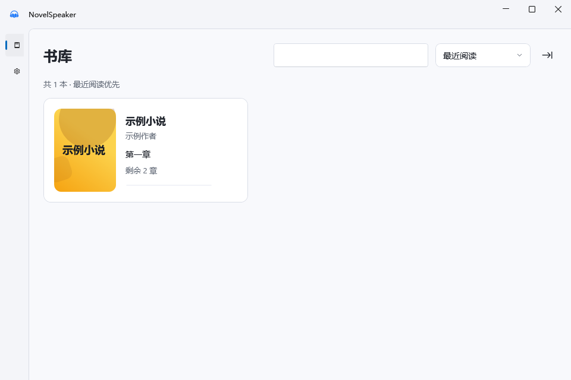
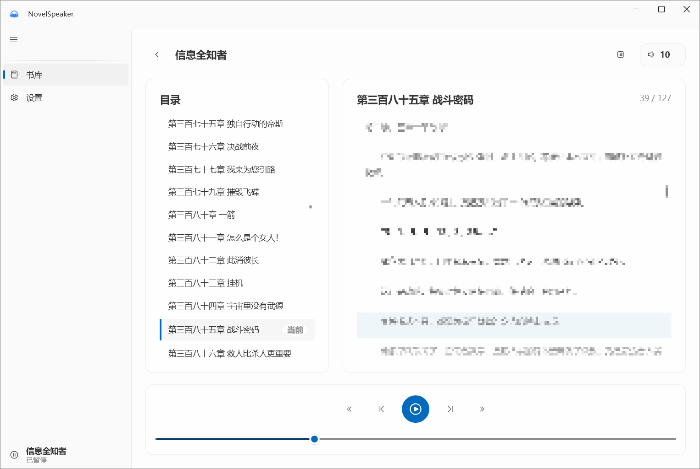
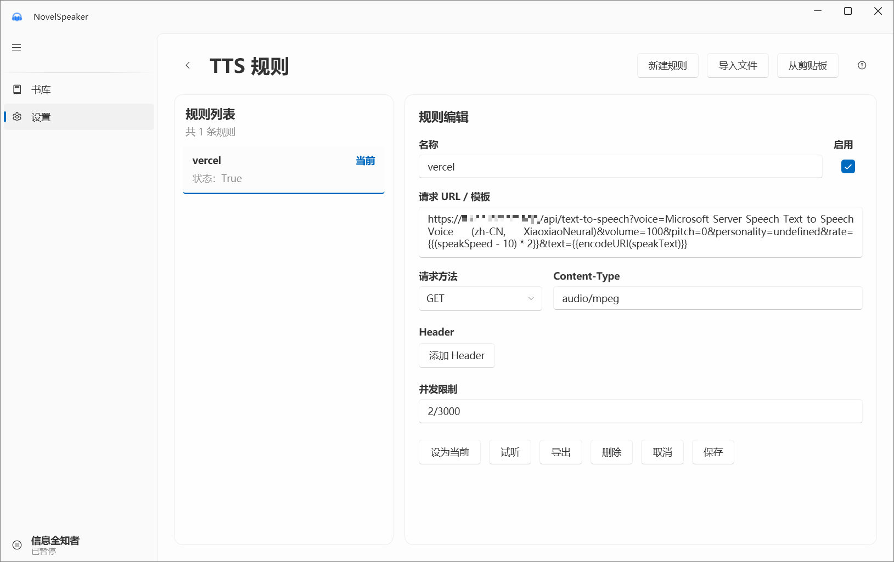
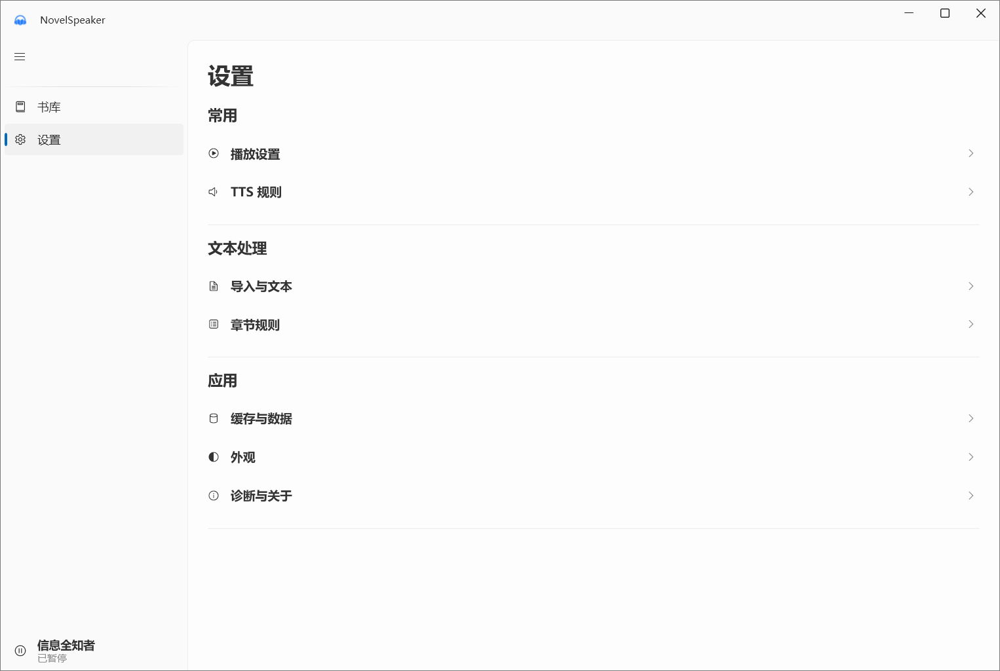

<p align="center">
  
</p>

<h1 align="center">NovelSpeaker</h1>

<p align="center">面向 Windows 10/11 的本地 TXT 小说听书应用。</p>

<p align="center">
  <a href="https://github.com/Drunk-Dream/NovelSpeaker/actions/workflows/ci.yml"></a>
  <a href="https://github.com/Drunk-Dream/NovelSpeaker/releases/latest"></a>
  <a href="LICENSE"></a>
  
  
</p>

NovelSpeaker 专注于一条清晰可靠的链路：导入本地 TXT 小说，选择 HTTP TTS 规则，完整下载音频后连续播放，并在本地缓存音频与阅读进度。它不是通用电子书阅读器，也不抓取在线小说。

## 下载与安装

从 [Releases](https://github.com/Drunk-Dream/NovelSpeaker/releases/latest) 下载 `NovelSpeaker-vX.Y.Z-win-x64.zip`，解压到任意有写入权限的目录后运行 `NovelSpeaker.App.exe`。

- Windows 10 22H2+ 或 Windows 11，x64。
- 发布包自包含，不需要另装 .NET Runtime。
- 当前发布未进行代码签名；SmartScreen 首次运行可能提示，请仅从本仓库 Release 获取程序。

应用数据保存在 `%LocalAppData%\NovelSpeaker`；删除程序目录不会自动删除书籍、缓存和设置。

## 快速开始

1. 在书库页点击“导入小说”图标，选择本地 TXT。常见编码会直接导入，无法可靠判断时再选择编码。
2. 在“设置 → TTS 规则”新建或导入兼容的 HTTP TTS 规则，并使用“试听”验证。
3. 打开书籍开始播放；播放页支持章节/段落切换、语速调整、播放进度和正文自动定位。可在“设置 → 播放设置”开启朗读标题。播放页的“缓存”可多选章节并启动后台主动缓存，“定时停止”和“迷你播放器”也从这里打开。
4. 在“设置 → 章节规则”管理章节识别；在“设置 → 导入与文本 → 正则替换”管理展示/朗读文本替换。
5. 在“设置 → 缓存与数据”查看或清理缓存；进入“缓存管理”后可多选章节，并将当前配置下完整缓存的章节按章导出为 MP3。
6. 在“设置 → 常规”选择关闭主窗口时最小化到托盘、退出或每次询问，也可启用启动后最小化到托盘。

## 界面预览

| 书库 | 播放 |
| --- | --- |
|  |  |

| TTS 规则 | 设置 |
| --- | --- |
|  |  |

## 当前能力

- 本地 TXT 导入、编码检测、章节识别、动态文本分段和进度恢复。
- Legado 风格 HTTP TTS 规则：GET、POST JSON、POST Form、Header、Body、模板变量和受限 JavaScript 表达式。
- 完整下载后播放、后续段落预取、NAudio 本地播放和 LRU 音频缓存。
- 播放设置支持开启朗读标题，并将标题纳入播放、缓存和 MP3 导出的段落顺序。
- 全局正则替换：可分别处理展示文本和朗读文本，不需要重新导入小说。
- 章节级主动缓存：支持多选章节、后台顺序缓存、侧栏进度查看和取消；离开播放页或隐藏主窗口不会中断任务。
- 文件管理器式按章缓存管理；当前规则、语速和文本处理配置下完整缓存的章节可各自导出为一个 MP3，已有同名文件不会被覆盖。
- Windows 媒体键和系统媒体面板：播放/暂停、上一段、下一段，以及当前书名、章节和播放状态。
- 系统托盘、可置顶的迷你播放器，以及 15/30/45/60/90 分钟或自定义时长的定时停止。
- 章节规则管理、规则试听和未保存修改保护。
- 深色、浅色、跟随系统主题；键盘快捷键和基础可访问性支持。
- “诊断与关于”提供日志目录、脱敏诊断摘要和第三方许可证入口。

## 隐私与安全

TTS 规则可能包含服务凭据。NovelSpeaker 会对常规日志、错误摘要和诊断摘要中的请求凭据与正文类字段进行脱敏；不要在截图、Issue 或日志中主动分享规则原文或私人小说正文。

当前规则中的敏感值保存在本地应用数据中，尚未提供独立 SecretStore。规则脚本由受限 Jint 环境执行，不能访问 CLR、文件系统、进程或反射。

## 快捷键

| 快捷键 | 操作 |
| --- | --- |
| `Ctrl+O` | 导入 TXT 小说 |
| `Space` | 播放/暂停（仅播放页） |
| `Ctrl+Left` / `Ctrl+Right` | 上一段 / 下一段（仅播放页） |
| `Ctrl+Shift+Left` / `Ctrl+Shift+Right` | 上一章 / 下一章（仅播放页） |
| `Ctrl+A` | 全选章节（播放页主动缓存选择模式或缓存管理页） |
| `Alt+Left` / `Esc` | 返回或关闭当前临时界面 |
| `Ctrl+,` | 打开设置 |

文本输入、下拉框、弹出面板、菜单和对话框打开时不会触发应用级快捷键。

## 当前限制

- 仅支持 TXT；不支持 EPUB、PDF、MOBI 和在线书源。
- TTS 仅实现当前文档定义的 HTTP 规则兼容子集，不保证所有社区规则无需修改即可运行。
- 音频采用完整段落生成后播放，不提供真正的实时流式 TTS。
- 同一时间只能运行一个主动缓存批次；任务进度不跨应用重启恢复。
- MP3 导出不会自动补全缺失音频，只导出当前规则、语速和文本处理配置下已经完整缓存的章节。
- 系统媒体面板的上一项/下一项按键对应上一段/下一段，章节切换请使用应用播放界面或迷你播放器。
- 不提供用户账户、云同步、语音克隆、插件市场或自动更新。
- 首发版本未进行代码签名，规则敏感值尚未使用独立凭据存储加密。

## 本地开发

需要 Windows、.NET SDK `10.0.301`（由 `global.json` 固定）和 x64 环境。

```powershell
dotnet restore --locked-mode -r win-x64
dotnet format --verify-no-changes --no-restore
dotnet build -c Release --no-restore
dotnet test -c Release --no-build
dotnet run --project src/NovelSpeaker.App
```

仓库级 `RuntimeIdentifiers` 会让命令行和 IDE 的隐式还原都保留 `win-x64` 锁文件目标。

## 架构与开发计划

项目使用 Domain / Application / Infrastructure / App 分层。业务逻辑不写在 code-behind；ViewModel 不直接访问 HTTP 或 SQLite；播放、缓存、规则执行和 UI 生命周期保持明确状态所有权。

详细设计与下一阶段开发计划见 [docs/README.md](docs/README.md)。

## 许可证

NovelSpeaker 以 [GPL-3.0-or-later](LICENSE) 发布。第三方组件及许可证见 [THIRD-PARTY-NOTICES.txt](THIRD-PARTY-NOTICES.txt)。
